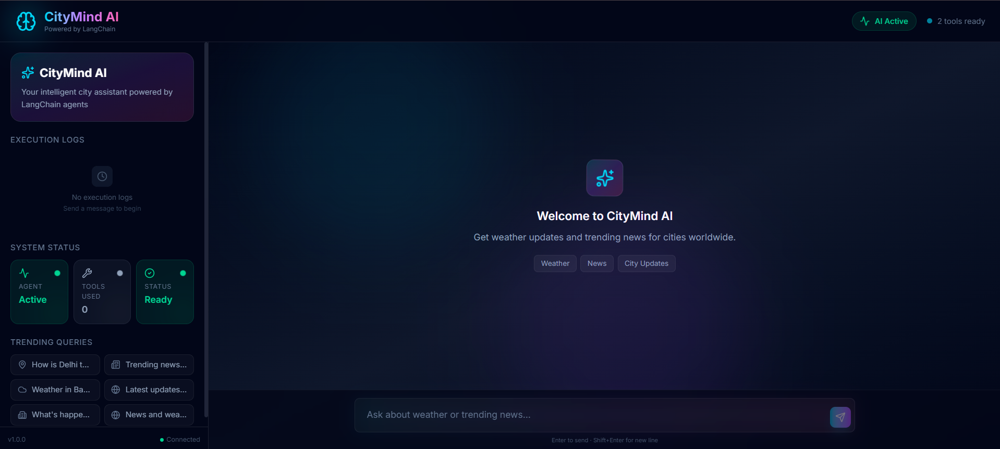
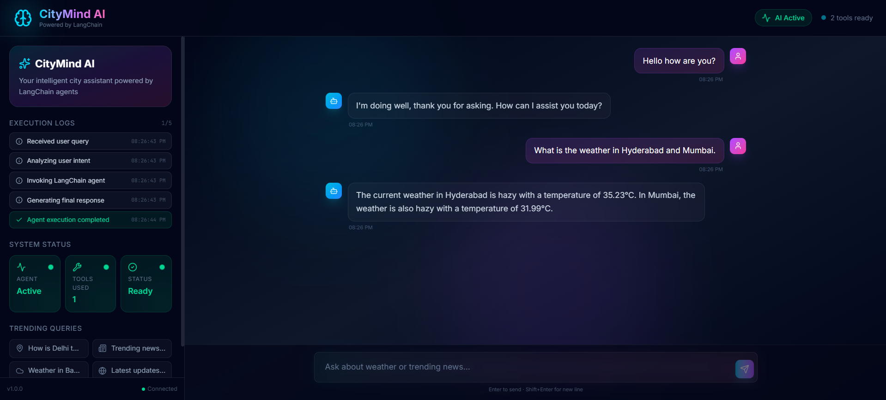
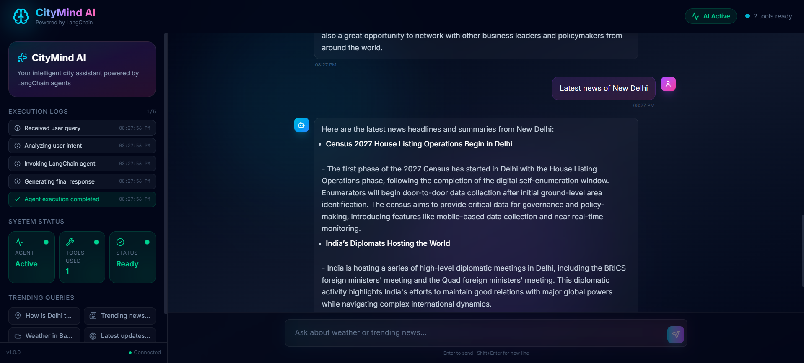

# 🌆 CityMind AI

CityMind AI is a modern AI-powered city assistant built using LangChain Agents, FastAPI, and a futuristic AI SaaS-style frontend.

The assistant can:
- fetch real-time weather information
- retrieve trending city news
- dynamically select tools based on user intent
- visualize AI orchestration workflows
- provide a conversational AI experience

---


# 📸 Screenshots

## 🖥️ Main Chat Interface



## 🌦️ Weather 



## 📰 News Responses



---

# 🚀 Features

## 🤖 AI Agent Orchestration
- LangChain Agent architecture
- Multi-tool reasoning
- Dynamic tool selection
- Execution workflow visualization

## 🌦️ Weather Tool
- Real-time weather retrieval
- OpenWeather API integration
- Temperature + weather conditions

## 📰 News Tool
- Live trending news retrieval
- Tavily Search integration
- AI summarized news responses

## ⚡ FastAPI Backend
- REST API architecture
- Structured JSON responses
- Execution logs
- Modular backend structure

## 🎨 Modern AI Frontend
- Futuristic AI SaaS UI
- Dark glassmorphism theme
- Animated execution logs
- Responsive design
- Smooth chat experience

---

# 🛠️ Tech Stack

## Backend
- Python
- FastAPI
- LangChain
- Mistral AI
- Tavily API
- OpenWeather API

## Frontend
- Next.js
- Tailwind CSS
- Framer Motion

---

# 📂 Project Structure

```bash
citymind-ai/
│
├── backend/
│   ├── app.py
│   ├── agent.py
│   ├── tools.py
│   ├── middleware.py
│   ├── requirements.txt
│   └── .env
│
├── frontend/
│
├── .gitignore
└── README.md
```

---

# ⚙️ Backend Setup

## 1. Navigate to backend

```bash
cd backend
```

## 2. Create virtual environment

```bash
python -m venv venv
```

## 3. Activate virtual environment

### Windows
```bash
venv\Scripts\activate
```

### Mac/Linux
```bash
source venv/bin/activate
```

## 4. Install dependencies

```bash
pip install -r requirements.txt
```

## 5. Add environment variables

Create `.env`

```env
OPENWEATHER_API_KEY=your_key
TAVILY_API_KEY=your_key
MISTRAL_API_KEY=your_key
```

## 6. Run FastAPI server

```bash
uvicorn app:app --reload
```

Backend runs at:

```bash
http://127.0.0.1:8000
```

Swagger Docs:

```bash
http://127.0.0.1:8000/docs
```

---

# 💻 Frontend Setup

## 1. Navigate to frontend

```bash
cd frontend
```

## 2. Install dependencies

```bash
npm install
```

## 3. Run frontend

```bash
npm run dev
```

Frontend runs at:

```bash
http://localhost:3000
```

---

# 🔁 API Flow

```text
Frontend UI
    ↓
FastAPI Backend
    ↓
LangChain Agent
    ↓
Tool Selection
    ↓
Weather / News APIs
    ↓
AI Response Generation
```

---

# 🧠 Agent Workflow

Example flow:

```text
User Query
   ↓
Intent Analysis
   ↓
Tool Selection
   ↓
Weather + News Retrieval
   ↓
LLM Response Synthesis
   ↓
Final AI Response
```
---

# 🔮 Future Improvements

- Conversation memory
- Human-in-the-loop approval workflows
- Persistent chat history
- Better geo-specific news retrieval
- Streaming responses
- Tool analytics dashboard

---

# 📌 Key Learnings

This project helped explore:
- AI agent orchestration
- LangChain tool calling
- FastAPI backend architecture
- Multi-tool reasoning
- AI workflow visualization
- Modern AI product UX

---

# ⭐ If You Like This Project

Feel free to star the repository and connect with me on LinkedIn.

---